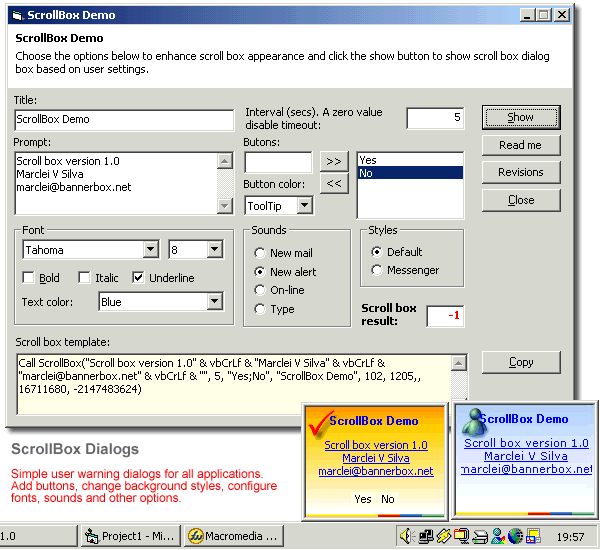



## ScrollBox 1\.0

### Description

Interactive user warning dialogs for all applications like MSN Messenger and Norton warning dialogs. Add buttons, change background styles, configure fonts, sounds and other options.
 
### More Info
 

             |
---                |---
**Submitted On**   |2004-04-22 19:12:40
**By**             |[Marclei V Silva](https://github.com/Planet-Source-Code/PSCIndex/blob/master/ByAuthor/marclei-v-silva.md)
**Level**          |Advanced
**User Rating**    |5.0 (35 globes from 7 users)
**Compatibility**  |VB 6\.0
**Category**       |[Custom Controls/ Forms/  Menus](https://github.com/Planet-Source-Code/PSCIndex/blob/master/ByCategory/custom-controls-forms-menus__1-4.md)
**World**          |[Visual Basic](https://github.com/Planet-Source-Code/PSCIndex/blob/master/ByWorld/visual-basic.md)
**Archive File**   |[TScrollBox1736574222004\.zip](https://github.com/Planet-Source-Code/marclei-v-silva-scrollbox-1-0__1-53329/archive/master.zip)

